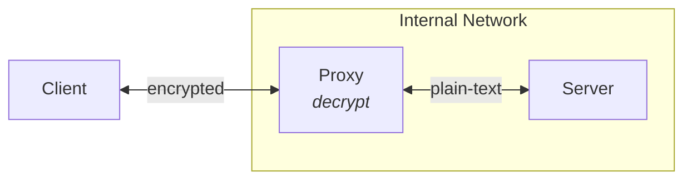
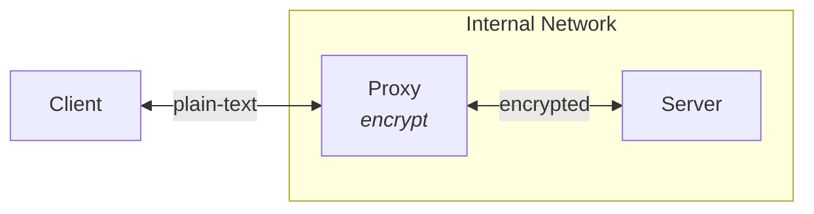
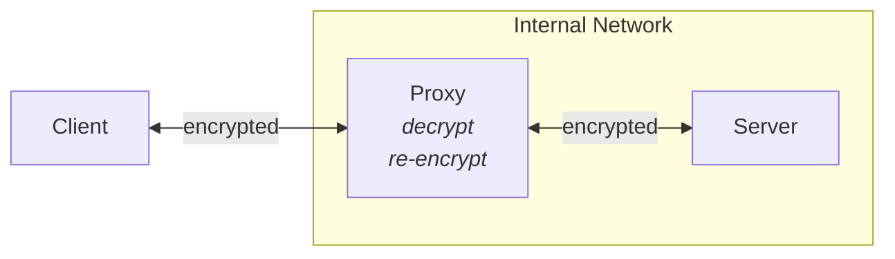
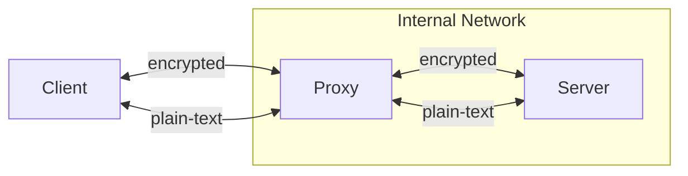

# TLS Proxy

## TLS Termination

### Offloading

TLS offloading of inbound encrypted TLS connection from a client and forwarding communications over a plain text connection to the server.

### Encryption

TLS encryption of inbound plain-text connection from a client and forwarding communications over an encrypted TLS connection to the server.

### Bridging

TLS bridging of two encrypted TLS connections to allow inspection and filtering of encrypted traffic by decrypting inbound TLS connection from a client and re-encrypting it with another TLS connection to the server.

## TLS Passthrough

TLS passthrough passes encrypted HTTPS traffic all the way to the backend server without decrypting the traffic on the proxy.

